# Testing Life Cycle Workshop Report

**Student:** Leonardo Zambrano Toala  
**Course:** Software Engineering II  
**Teacher:** Dr. Carlos Mera Gómez  
**Institution:** Escuela Superior Politécnica del Litoral  
**Year:** 2026

---

## Part 1: Prepare the Project

The repository was forked and cloned. A Python virtual environment was created, the project dependencies were installed, and the inherited test suite was executed without changing the source code or the inherited tests.

The initial execution produced **15 passed tests**.

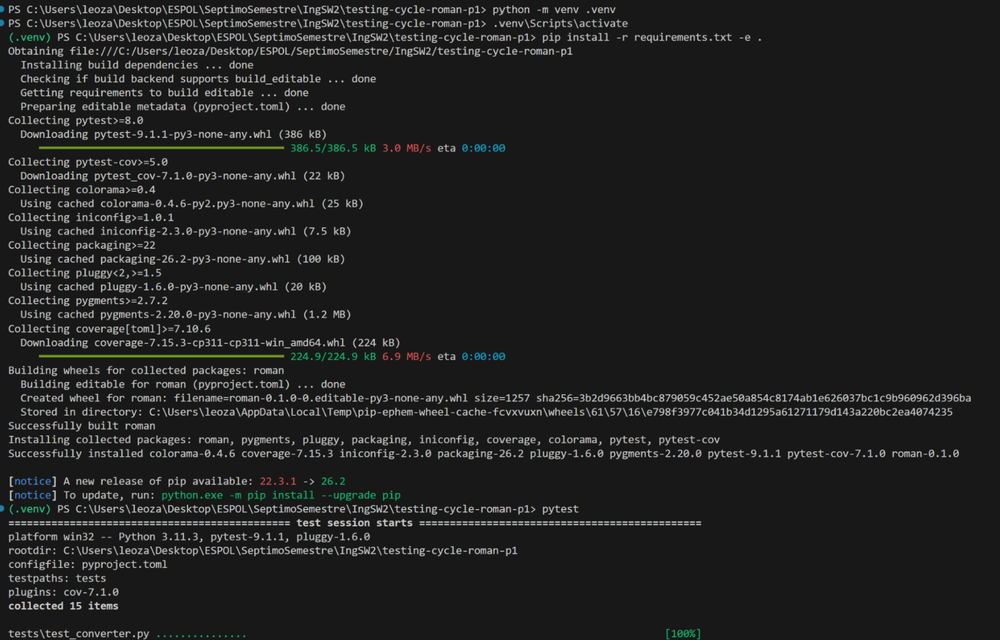

---

## Part 2: Audit the Inherited Suite

Initial branch coverage was measured with:

```bash
python -m pytest --cov=roman.converter --cov-branch --cov-report=term-missing
```

The inherited suite produced **15 passed tests** and **64% coverage**.

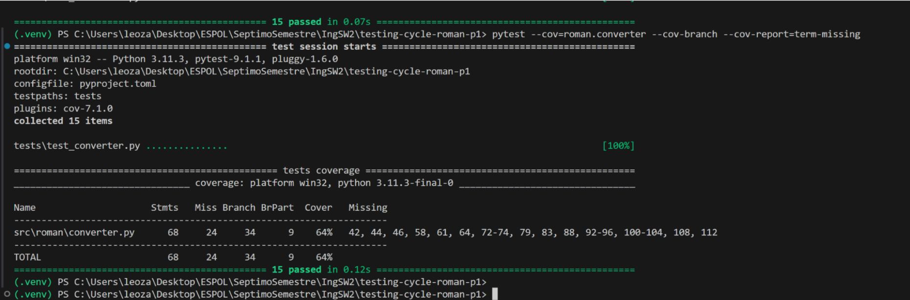

---

## Part 3: Test at the Unit Level

The unit-level analysis was derived from the source code of `to_roman`. Therefore, these tests are structural or white-box tests.

### 3.1 Control Flow Graph


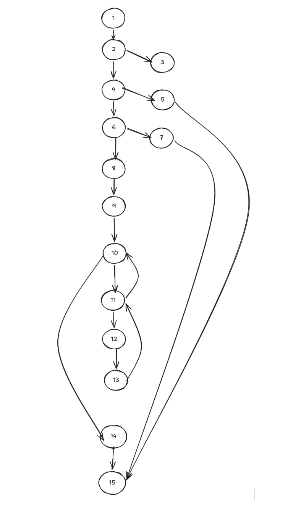

### 3.2 Cyclomatic Complexity

Using the corrected control flow graph:

- Number of nodes: `N = 16`
- Number of edges: `E = 21`

The cyclomatic complexity is:

```text
V(G) = E - N + 2
V(G) = 21 - 16 + 2
V(G) = 7
```

Therefore, the basis set must contain **7 linearly independent paths**.

### 3.3 Basis Set of Independent Paths

> Replace the paths below only if your final graph uses different node numbers. The number of paths must remain equal to `V(G)`.

```text
P1: [insert path 1 from the corrected CFG]
P2: [insert path 2 from the corrected CFG]
P3: [insert path 3 from the corrected CFG]
P4: [insert path 4 from the corrected CFG]
P5: [insert path 5 from the corrected CFG]
P6: [insert path 6 from the corrected CFG]
P7: [insert path 7 from the corrected CFG]
```

### 3.4 Definition-Use Analysis

| Line | Definition | c-use | p-use |
|---:|---|---|---|
| 40 | `n` |  |  |
| 41 |  |  | `n` in both parts of the compound predicate |
| 43 |  |  | `n` |
| 45 |  |  | `n` |
| 47 | `out` |  |  |
| 48 | `remaining` | `n` |  |
| 49 | `value`, `symbol` |  |  |
| 50 |  |  | `remaining`, `value` |
| 51 |  | `out`, `symbol` |  |
| 52 | `remaining` | `remaining`, `value` |  |
| 53 |  | `out` |  |

### 3.5 DU-Pairs

| Definition → Use | Variable | Use type |
|---|---|---|
| 40 → 41 | `n` | p-use, first predicate |
| 40 → 41 | `n` | p-use, second predicate |
| 40 → 43 | `n` | p-use |
| 40 → 45 | `n` | p-use |
| 40 → 48 | `n` | c-use |
| 47 → 51 | `out` | c-use |
| 47 → 53 | `out` | c-use |
| 48 → 50 | `remaining` | p-use |
| 48 → 52 | `remaining` | c-use |
| 52 → 50 | `remaining` | p-use |
| 52 → 52 | `remaining` | c-use |
| 49 → 50 | `value` | p-use |
| 49 → 52 | `value` | c-use |
| 49 → 51 | `symbol` | c-use |

The pair `52 → 50` is created because `remaining` is redefined inside the `while` loop and used again in the predicate during the following iteration. The pair `52 → 52` occurs when the updated value is used again in another execution of the subtraction statement.

### 3.6 Unit Test Coverage

Additional structural tests were implemented without modifying or deleting the 15 inherited tests. After adding the unit tests, the suite produced **29 passed tests** and **90% coverage**, exceeding the required 85%.

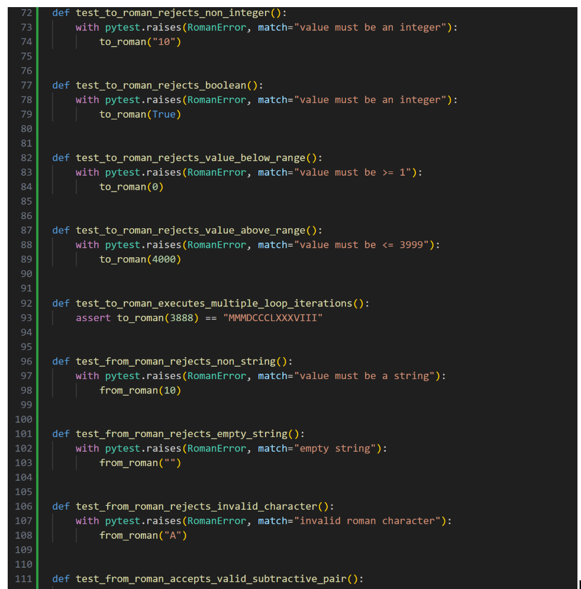
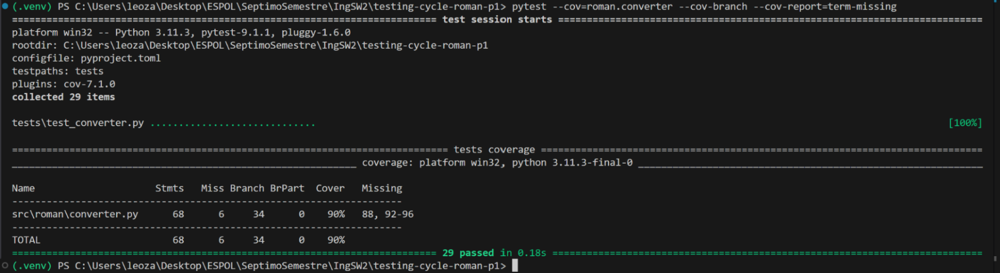

---

## Part 4: Test at the Integration Level

### 4.1 Integration Scenario

The integration test verified the collaboration between `add_roman`, `subtract_roman`, `from_roman`, `to_roman`, and `is_valid_roman`.

The main scenario executed:

```python
result = add_roman("II", "II")

assert result == "IV"
assert from_roman(result) == 4
assert is_valid_roman(result) is True
```

### 4.2 Integration Defect Found

The test failed because `add_roman("II", "II")` returned `IIII` instead of the canonical Roman numeral `IV`.

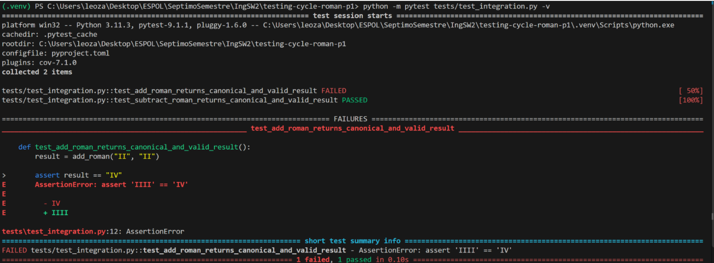

The inherited unit tests did not detect this defect because they exercised individual functions and simple values independently. They did not verify the complete collaboration between arithmetic, conversion, canonical representation, and validation for the value four.

### 4.3 Correction and Verification

The defect was located in the `_PAIRS` collection used by `to_roman`.

Incorrect code:

```python
(5, "IV")
```

Corrected code:

```python
(4, "IV")
```

After the correction, both integration tests passed. The result `IV` was successfully converted back to 4 by `from_roman` and accepted by `is_valid_roman`.

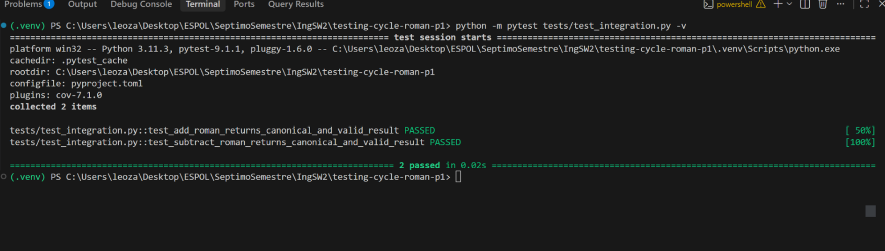

---

## Part 5: Test at the Acceptance Level

The acceptance tests were derived from `ESPECIFICACION.md`, not from the source code.

### 5.1 Acceptance Criterion 1: Outer Whitespace

**Given** a valid canonical Roman numeral with leading and trailing whitespace  
**When** the user converts `"  IV  "` using `from_roman`  
**Then** the system returns the integer `4`

### 5.2 Acceptance Criterion 2: Noncanonical Numeral

**Given** the noncanonical Roman numeral `"IIII"`  
**When** the user attempts to convert it using `from_roman`  
**Then** the system raises `RomanError` because the canonical representation of 4 is `"IV"`

### 5.3 Acceptance Criterion 3: Non-string Validation

**Given** a value that is not a string  
**When** the user validates the integer `123` using `is_valid_roman`  
**Then** the system returns `False` without raising an exception

### 5.4 Acceptance Test Execution Before Correction

The acceptance tests were executed when coverage was already **90%**.

The results were:

- `test_acceptance_trims_leading_and_trailing_whitespace`: **FAILED**
- `test_acceptance_rejects_noncanonical_roman_numeral`: **FAILED**
- `test_acceptance_validation_returns_false_for_non_string`: **PASSED**

The execution produced **2 failed, 32 passed, and 90% coverage**.

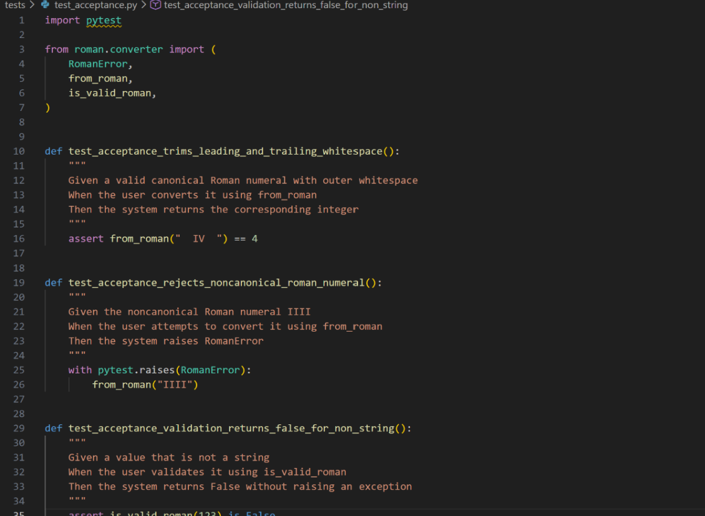
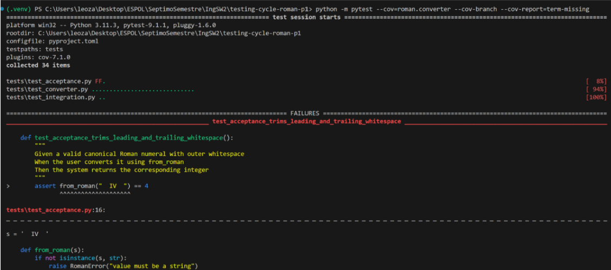
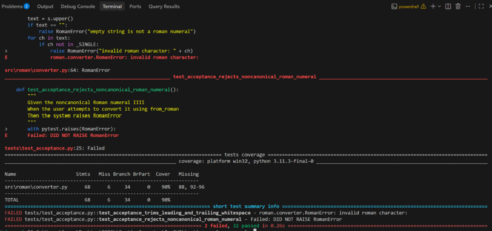

The whitespace test failed because `from_roman` did not remove leading and trailing whitespace. The noncanonical test failed because `from_roman("IIII")` returned 4 instead of raising `RomanError`.

Branch coverage could not reveal these defects because it only measures whether branches of the implementation were executed. It does not verify whether the observed behavior complies with the functional specification.

---

## Part 6: Iteration

The results from the unit, integration, and acceptance tests were compared before modifying the implementation. Three defects were identified and corrected.

### 6.1 Defect 1: Incorrect Representation of `IV`

**Testing level:** Integration testing

The integration test found that `add_roman("II", "II")` returned `IIII` instead of `IV`.

```python
# Before
(5, "IV")

# After
(4, "IV")
```

Commit message:

```text
fix(integration): correct IV value per spec section 7
```

### 6.2 Defect 2: Outer Whitespace Was Not Removed

**Testing level:** Acceptance testing

The acceptance test found that `from_roman("  IV  ")` raised `RomanError`, although the specification requires leading and trailing whitespace to be ignored.

```python
# Before
text = s.upper()

# After
text = s.strip().upper()
```

Commit message:

```text
fix(acceptance): trim outer whitespace per spec section 3
```

### 6.3 Defect 3: Noncanonical Numeral Was Accepted

**Testing level:** Acceptance testing

The acceptance test found that `from_roman("IIII")` returned 4 instead of raising `RomanError`. Canonical-format validation was added. After the correction, `from_roman("IIII")` raises `RomanError` and `is_valid_roman("IIII")` returns `False`.

Commit message:

```text
fix(acceptance): reject noncanonical numerals per spec section 4
```

### 6.4 Commit Evidence

Each correction was recorded in a separate commit, and each message states the testing level that revealed the defect.

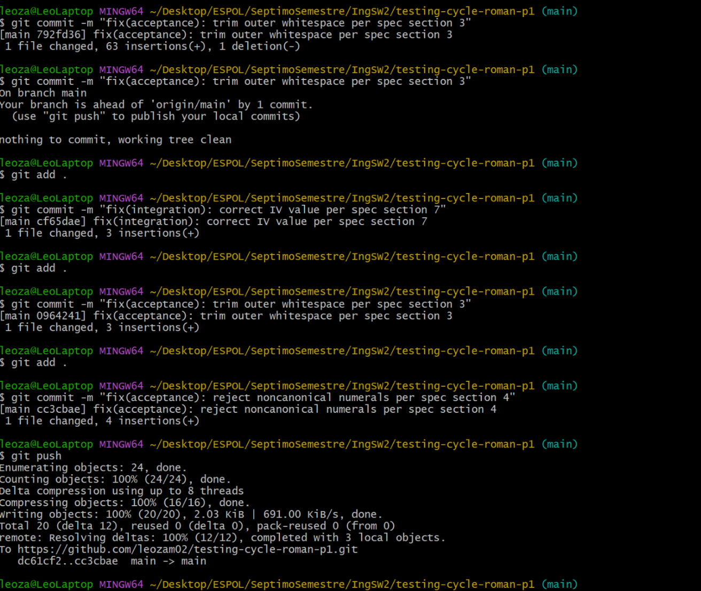

### 6.5 Final Verification

After correcting the three defects, the complete suite was executed again with branch coverage enabled.

Final results:

- **34 tests passed**
- **0 tests failed**
- **94% coverage**
- The 15 inherited tests were not modified or deleted
- Each fix was committed separately

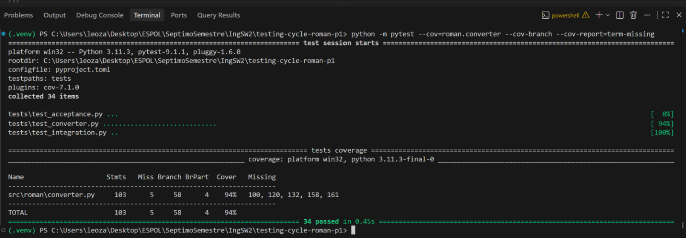

---

## Conclusion

The workshop demonstrated that structural coverage and functional correctness are different concerns. Unit tests raised branch coverage above 85%, but integration and acceptance tests still revealed defects that structural coverage alone could not identify. After correcting the three defects, the complete suite remained green and coverage stayed above the required threshold.
